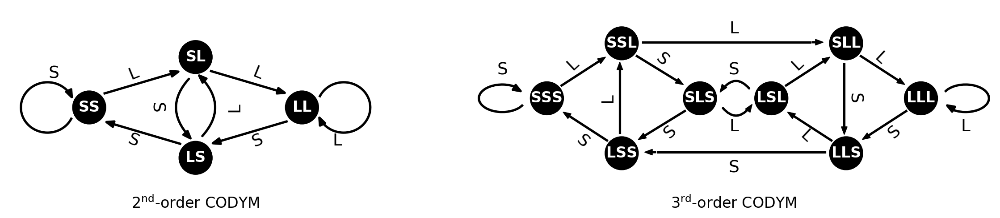
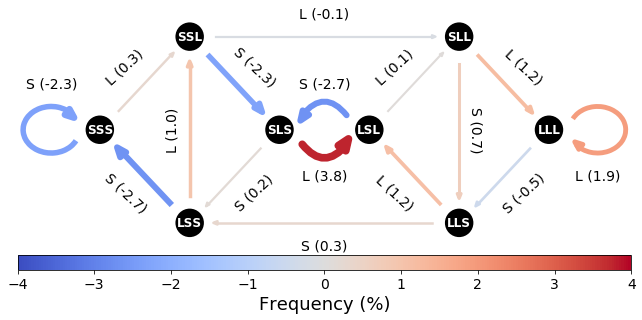
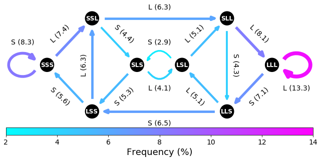

# COnversational DYnamics Model (CODYM)

The CODYM is a Markov-based model of conversational dynamics based on the binarized length of speaker turns. CODYM analysis offers a robust methodology for examining information flow between conversational participants in a variety of contexts. 

The nodes of a *k*-order CODYM represent the binarized lenghts of the previous *k* turns. Edges of the model represent the length of the current turn. Models are populated with the frequency of occurrance of each state/transition in all turns in a corpus (or any specified subset thereof). In the 2-order and 3-order models below, **S** represents a short turn and **L** represents a long turn.

|:--:| 
| *Example of un-populated 2nd- and 3rd-order CODYMs* |

The following scripts can be used to populate a CODYM model and draw the state space diagram for 2- and 3-order models, for both standard and "difference" CODYMS. For demonstration purposes, two examples are included. The first example (`CODYM_example1.py`) comes from our forthcoming paper [1], using the anonymized dataset contained in the supporting information, and depicts conversations between patients with advanced cancer and palliative care clinicians. This "difference" CODYM shows how information flow patterns vary between patient turns where distressing emotion was expressed vs. those conversations without these emotions detected. 

|:--:| 
| *Difference CODYM between patient turns in conversations with expressed emotion and without* |

The second example (`CODYM_example2.py`) creates a CODYM model for the Supreme Court Corpus, as distributed from Cornell's [ConvoKit](https://convokit.cornell.edu/) Conversation Analysis Toolkit. This script will require installing ConvoKit, which can be done [here](https://convokit.cornell.edu/). This script produces 2nd- (not pictured here) and 3rd-order CODYMs representing the average for all 553 conversations in the Supreme Court Corpus with at least 20 utterances.

|:--:| 
| *Normative CODYM of the Supreme Court Corpus* |

This code is still very much in development, and comes with no guarantees. For more information on CODYM analysis and how to interpret a CODYM, see our [preprint](https://arxiv.org/abs/2010.05164) on this novel method and an example application in the study of serious illness communication.
